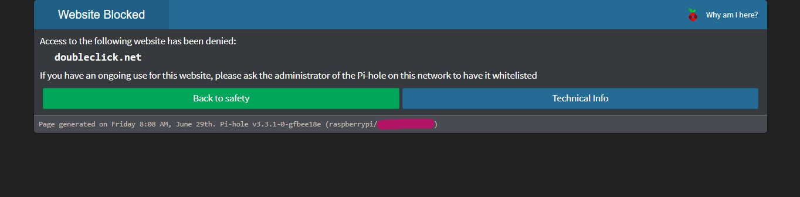

# Custom block page

The original Pi-Hole code has been modified, first modified 26/06/2018. [License](https://github.com/pi-hole/pi-hole/blob/master/LICENSE).

Info/steps on my custom Pi-Hole block page. It's not finished yet I don't think, but I hope this works as a helpful guide for others.   
Thanks to Pi-Hole (Original code [here](https://github.com/pi-hole/pi-hole), site [here](https://pi-hole.net/)) for being awesome and WaLLy3K for providing [the idea and direction](https://github.com/WaLLy3K/Pi-hole-Block-Page).

Custom dark theme of Pi-Hole's blockpage for your sleepy eyes.

---

# 1. Back-up  
From root, copy the pihole directory to wherever you want to back-it-up to. E.g: **cp -r /var/www/html/pihole/ home/pi/**  
Don't blame me if your Pi-Hole blows up.

# 2. Shuffle around files  
Rename the original block page in /var/www/html/pihole/. Doesn't matter what to, I just used ORIG_blockingpage.css.  
Move the background you want into /var/www/html/admin/img/. The one I used is up there, bg.png.

# 3. Custom blockpage  
Move blockingpage.css into /var/www/html/pihole/.
